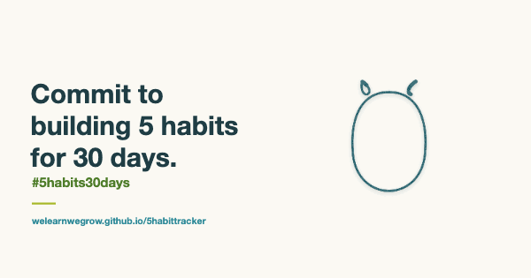

# 5 Habit Tracker

**Commit to building 5 habits for 30 days.** `#5habits30days`

5 Habit Tracker is a tiny app for keeping five habits for a month. It has no streak shaming, no accounts and no notifications. You tick off your five habits, and on each day you complete all of them, a new kolam draws itself on your screen.

👉 **Open the app:** https://welearnwegrow.github.io/5habittracker/

---

## How it works

1. **Choose five habits** for the month. Keep them small enough to do on a busy day: walk for 20 minutes, read 10 pages, drink water before coffee.
2. **Tick them off each day.** Use the arrows to move between days, or open the calendar to jump to any day this month.
3. **Complete all five, and a kolam appears.** Each one is generated from that day's date, so no two are alike. Some days you'll draw a rare or legendary one, with more rings, more colour and finer symmetry.
4. **Reach 25 full days in the month** and that month's avatar draws itself and comes to life. There are twelve, one for each month, all from Indian folk art. The aim is 30 days, but 25 is enough, so you have a grace day each week. Which one you get stays a surprise until you get there.
5. **Start fresh each month.** Keep the same five habits or choose new ones. Every kolam and avatar you've earned stays in your Collection.

A new quote appears each day, from people like Wangari Maathai, Rabindranath Tagore, Thich Nhat Hanh and Nelson Mandela, and from proverbs around the world.

## Why kolams?

A kolam is a design drawn each morning at the threshold of a home in South India, traditionally in rice flour. It's made by hand, in a few minutes, and it's gone by evening. It is a daily practice and a small act of care that you repeat, not something you make once and keep.

That felt like the right way to think about habits. You don't build one big result. You make something small, every day, and over a month those small things add up to a pattern.

## Why it works

The app is built around two ideas from neuroscience.

- **Context and reward train the striatum.** The basal ganglia, and the striatum within them, learn which action to take in a given situation from reward (Shivkumar, Muralidharan & Chakravarthy, 2017). Doing the same five things in the same daily context, and getting a kolam when you finish, gives that system a clear context and a clear reward.
- **Small and daily beats big and rare.** Lasting memories need the brain to change the connections between neurons, and sleep helps those changes last (Rennó-Costa et al., 2019). One small session a day, with a night's sleep in between, suits how that consolidation works better than one long push.

**Research**

- Shivkumar, S., Muralidharan, V. & Chakravarthy, V. S. (2017). A biologically plausible architecture of the striatum to solve context-dependent reinforcement learning tasks. *Frontiers in Neural Circuits*, 11:45. IIT Madras, India. https://doi.org/10.3389/fncir.2017.00045
- Rennó-Costa, C., Costa da Silva, A. C., Blanco, W. & Ribeiro, S. (2019). Computational models of memory consolidation and long-term synaptic plasticity during sleep. *Neurobiology of Learning and Memory*, 160, 32–47. UFRN, Brazil. https://doi.org/10.1016/j.nlm.2018.10.003

## Add it to your phone

It works like an app once it's on your home screen:

- **iPhone (Safari):** tap Share → **Add to Home Screen**
- **Android (Chrome):** tap ⋮ → **Install app** or **Add to Home screen**

## Your data

- Everything is stored **on your device only**, in your browser's local storage. Nothing is sent anywhere.
- There's no login, so if you clear your browser data or switch phones, your progress won't come with you.
- To keep a copy, open the calendar and tap **Download CSV**.

## What's in this repo

| File | What it does |
| --- | --- |
| `index.html` | The whole app: Start, Tracker, Collection and About screens |
| `avatars.js` | The generative kolams and the twelve animated monthly avatars |
| `manifest.json` | App name and colours for the home screen |
| `icons/` | Owl app icons, and the share image (`share.png`) and animation (`share.gif`) |

There's no build step and there are no dependencies. It's static files served by GitHub Pages.

## Run your own copy

1. Fork this repo.
2. Go to **Settings → Pages**, choose **Deploy from a branch**, and select `main` / root.
3. Your copy will be live at `https://<your-username>.github.io/5habittracker/` in a minute or two.

## Share it

Post your progress with **#5habits30days**. `icons/share.gif` is an animated image you can post directly.

## Feedback

Found a bug, or have an idea? [Contact the creator](https://welearnwegrow.bio/). Notes on how you're using it are welcome too.

---

Made by [We Learn, We Grow](https://welearnwegrow.bio/) · 2026 · Licensed under [CC BY-ND 4.0](https://creativecommons.org/licenses/by-nd/4.0/)
